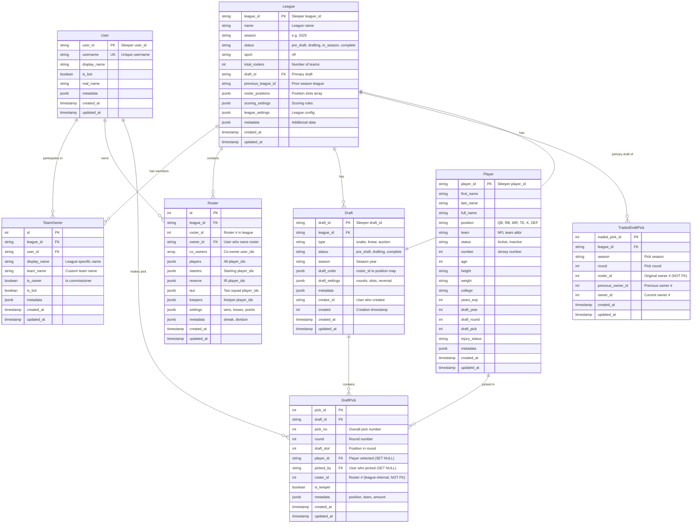

# Entity Relationship Diagram

Visual representation of the Sleeper Mock Draft Agent database schema.

## Full ERD (Mermaid)



## Simplified Relationship View

```
                    ┌─────────────┐
                    │    User     │
                    │ (Team Owner)│
                    └──────┬──────┘
                           │
                ┌──────────┴──────────┐
                │                     │
                ▼                     ▼
         ┌─────────────┐      ┌──────────┐
         │ LeagueUser  │      │  Roster  │
         └──────┬──────┘      └─────┬────┘
                │                   │
                ▼                   │
         ┌─────────────┐            │
         │   League    │◄───────────┘
         └──────┬──────┘
                │
      ┌─────────┼─────────┐
      │         │         │
      ▼         ▼         ▼
  ┌───────┐ ┌───────┐ ┌──────────────┐
  │ Draft │ │Roster │ │TradedDraftPck│
  └───┬───┘ └───────┘ └──────────────┘
      │
      ▼
  ┌──────────┐
  │DraftPick │
  └──────────┘
```

## Key Relationships

### 1. User ↔ League (Many-to-Many via TeamOwner)
- A user can participate in multiple leagues
- A league has multiple users
- Junction table `TeamOwner` stores league-specific user data (team name, display name)

### 2. User → Roster (One-to-Many)
- A user can own multiple rosters across different leagues
- Each roster has one primary owner (nullable)
- `Roster.co_owners` array can contain additional user_ids

### 3. League → Roster (One-to-Many)
- Each league has multiple rosters (teams)
- Each roster belongs to exactly one league
- Composite unique constraint on `(league_id, roster_id)`

### 4. League → Draft (One-to-Many)
- A league can have multiple drafts (startup, rookie, supplemental)
- Each draft belongs to one league
- League has a `draft_id` field pointing to the primary/most recent draft

### 5. Draft → DraftPick (One-to-Many)
- Each draft has multiple picks
- Each pick belongs to one draft
- Picks are ordered by `pick_no`
- DraftPick has FKs to User (picked_by) and Player
- DraftPick.roster_id is a league-internal number (1-N), not a database FK

### 6. League → TradedDraftPick (One-to-Many)
- Each league tracks its traded future picks
- All roster_id fields are league-internal numbers (1-N), not database FKs
- Unique constraint on `(league_id, season, round, roster_id)` ensures one record per original pick

### 7. League ↔ Draft (Bidirectional)
- League has FK `draft_id` pointing to primary draft
- Draft has FK `league_id` pointing to league
- ON DELETE SET NULL for draft_id to preserve league if draft deleted

## Cascade Behavior

### Deletes Cascade Down
```
League (deleted)
  ↓ CASCADE
  ├─ TeamOwner (deleted)
  ├─ Roster (deleted)
  ├─ Draft (deleted)
  │    ↓ CASCADE
  │    └─ DraftPick (deleted)
  └─ TradedDraftPick (deleted)

User (deleted)
  ↓ CASCADE
  ├─ TeamOwner (deleted)
  ├─ Roster.owner_id (SET NULL)
  └─ DraftPick.picked_by (SET NULL)

Draft (deleted)
  ↓ CASCADE
  ├─ DraftPick (deleted)
  └─ League.draft_id (SET NULL)

Player (deleted)
  ↓ SET NULL
  └─ DraftPick.player_id (SET NULL)
```

### SET NULL Behavior
- `Roster.owner_id` → SET NULL when User deleted
  - Preserves historical roster data even if user is removed
  - Can still see roster composition and stats
- `League.draft_id` → SET NULL when Draft deleted
  - Preserves league data even if primary draft is removed
- `DraftPick.player_id` → SET NULL when Player deleted
  - Preserves pick history even if player record is removed
- `DraftPick.picked_by` → SET NULL when User deleted
  - Preserves pick history even if user is removed

## Data Flow from Sleeper API → Database

```
Temporal Workflow: full_data_collection
  │
  ├─ team_owner_data_collection
  │    └─ Activity: get_team_owner_data
  │         └─ Database: INSERT/UPDATE User
  │
  ├─ league_data_collection
  │    ├─ Activity: get_league_data
  │    │    ├─ Database: INSERT/UPDATE League
  │    │    ├─ Database: INSERT/UPDATE TeamOwner (bulk)
  │    │    └─ Database: INSERT/UPDATE Roster (bulk)
  │    │
  │    └─ draft_data_collection (child workflow)
  │         ├─ Activity: get_league_drafts
  │         │    └─ Database: INSERT/UPDATE Draft (bulk)
  │         │
  │         ├─ Activity: get_specific_draft_picks
  │         │    └─ Database: INSERT/UPDATE DraftPick (bulk)
  │         │
  │         └─ Activity: get_traded_draft_picks
  │              └─ Database: INSERT/UPDATE TradedDraftPick (bulk)
  │
  └─ (optional) player_data_collection
       └─ Activity: get_nfl_players
            └─ Database: INSERT/UPDATE Player (bulk, 8000+ players)
```

## Query Patterns by Use Case

### Mock Draft Prediction
**Needed Tables**: Draft, DraftPick, League, Roster, Player (optional)
```sql
-- Get all completed drafts with picks for training data
SELECT d.draft_id, d.type, d.season,
       l.scoring_settings, l.roster_positions,
       dp.pick_no, dp.round, dp.player_id, dp.roster_id
FROM drafts d
JOIN leagues l ON d.league_id = l.league_id
JOIN draft_picks dp ON d.draft_id = dp.draft_id
WHERE d.status = 'complete'
ORDER BY d.draft_id, dp.pick_no;
```

### Team Analysis
**Needed Tables**: User, League, Roster, TeamOwner
```sql
-- Get team performance across all leagues
SELECT u.username, l.name as league_name, l.season,
       (r.roster_settings->>'wins')::int as wins,
       (r.roster_settings->>'losses')::int as losses,
       (r.roster_settings->>'points_for')::float as points_for
FROM users u
JOIN rosters r ON u.user_id = r.owner_id
JOIN leagues l ON r.league_id = l.league_id
WHERE u.user_id = ?
ORDER BY l.season DESC, wins DESC;
```

### Trade Analysis
**Needed Tables**: TradedDraftPick, League, Roster
```sql
-- Analyze draft pick trading patterns
SELECT tdp.season, tdp.round, 
       COUNT(*) as total_trades,
       COUNT(DISTINCT tdp.league_id) as leagues_with_trades
FROM traded_draft_picks tdp
GROUP BY tdp.season, tdp.round
ORDER BY tdp.season DESC, tdp.round;
```

### League Comparison
**Needed Tables**: League, Roster, Draft, DraftPick
```sql
-- Compare league competitiveness metrics
SELECT l.league_id, l.name, l.season,
       COUNT(DISTINCT r.roster_id) as num_teams,
       AVG((r.roster_settings->>'points_for')::float) as avg_points,
       STDDEV((r.roster_settings->>'points_for')::float) as points_stddev,
       COUNT(DISTINCT dp.draft_id) as num_drafts,
       COUNT(dp.pick_id) as total_picks
FROM leagues l
LEFT JOIN rosters r ON l.league_id = r.league_id
LEFT JOIN drafts d ON l.league_id = d.league_id
LEFT JOIN draft_picks dp ON d.draft_id = dp.draft_id
WHERE l.season = '2025'
GROUP BY l.league_id, l.name, l.season;
```

## Indexing Strategy

### Write-Heavy Tables (Frequent Updates)
- `Roster` - Updated weekly during season
- `League` - Updated as season progresses
- Keep indexes minimal to optimize write performance

### Read-Heavy Tables (Mostly Queries)
- `DraftPick` - Historical data, rarely updated
- `User` - Mostly static after collection
- Add more indexes for common query patterns

### JSONB Indexing
```sql
-- For queries filtering on JSONB fields
CREATE INDEX idx_roster_settings_wins ON rosters 
  ((settings->>'wins')::int);

-- For JSONB containment queries
CREATE INDEX idx_roster_players_gin ON rosters 
  USING GIN (players);

-- For JSONB existence queries
CREATE INDEX idx_league_metadata_gin ON leagues 
  USING GIN (metadata);
```

## Summary

This schema provides:
- ✅ Normalized structure for core entities
- ✅ Flexible JSONB for semi-structured API data
- ✅ Proper foreign keys and cascades
- ✅ Strategic indexes for common queries
- ✅ Historical data preservation
- ✅ Support for complex fantasy football use cases
